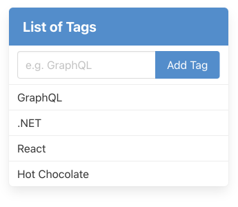
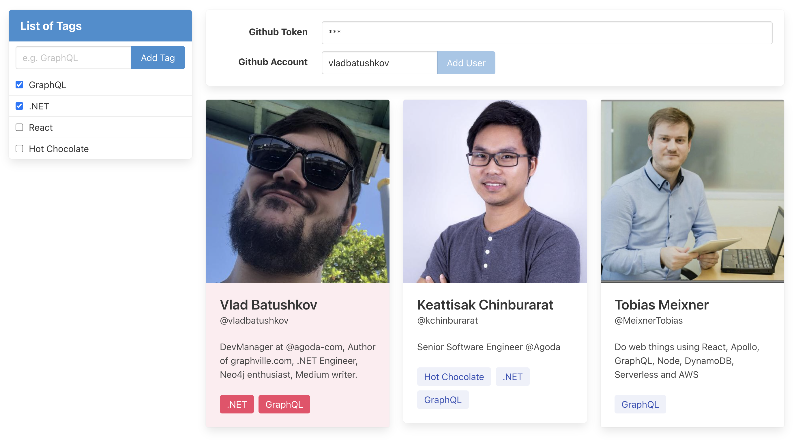

# GraphQL Gateway

Tutorial to build a GraphQL Gateway API powered by Hot Chocolate server. How to work with Queries, Mutations, Subscriptions, and Schema Stitching. Use under the hood NoSQL databases such as Neo4j, MongoDB and Redis.

## Workshop

Welcome to GraphQL Gateway API tutorial.

We recommend you to `fork` the repo and then start tutorial.

### Tutorial

- Folder `/src` contains **all ready-to-use services**.
- Services `gql`, `gw`, and `rest` have a `readme.md` file with a setp-by-setp tutorial how to create it.
- Explanation on how to build `web-clients` are not provided. You can use them just to run as is.

```sh
/src
  /gql-service # Apollo GraphQL Server connected to Neo4j Database
  /gw-service # Hot Chocolate GraphQL Gateway API
  /rest-service # .NET WebApi Swagger-based connected to MongoDB
  /web-clinet-list # React app for Phase 1
  /web-clinet-likes # React app for Phase 2
  docker-compose.yml # Can be used to build and run containers
```

We recommend you to take a quick overview of repository structure and then start Phase 1.

#### Phase 1: List of Tags

In first phase you will build a Hot Chocolate Gateway API connected to REST WebApi to manipulate list of Tags stored in MongoDB. You will learn how to resolve Query, Mutation and use Subscription.

1. Create WebAPI service using MongoDB using `/rest-service` tutorial (Optional).
2. Create GraphQL Gateway API using Hot Chocolate server using `/gw-service/readme-phase1.md` tutorial.
3. Frontend project is ready to use from `/web-client-list` folder.

Expectations:

- `rest-service` run as docker container.
- `gw-service` run locally using cli or as a docker container.
- `web-client-list` run locally using cli.



#### Phase 2: Friend Recommendations

Once Tags collection is working, now you will stitch your Gateway API schema with the schema of Apollo GraphQL server connected to Neo4j database.

1. Create GraphQL server connected to Neo4j using `/gql-service` tutorial (Optional).
2. Update GraphQL Gateway API using Hot Chocolate server using `/gw-service/readme-phase2.md` tutorial.
3. Frontend project is ready to use from `/web-client-likes` folder.

Expectations:

- `gql-service` run as docker container.
- `gw-service` run locally using cli or as a docker container.
- `web-client-likes` run locally using cli.



## Tech Stack

- Frontend
  - React / TypeScript
- Backend
  - .NET / C#
  - REST WebApi / Swagger
  - Gateway API / GraphQL / Hot Chocolate
  - NodeJS / Apollo Server
- NoSQL
  - Neo4j Graph Database
  - MongoDB
  - Redis

## Prerequisites

- Required:
  - Install IDE (VSCode https://code.visualstudio.com/download)
  - Install Docker (https://docs.docker.com/get-docker/)
  - Install .NET 6 SDK (https://dotnet.microsoft.com/en-us/download/dotnet/6.0)
  - Install Node 18 (via NVM https://github.com/nvm-sh/nvm)
- Good to know:
  - What is Docker (read https://docs.docker.com/get-started/)
  - What is REST (read https://en.wikipedia.org/wiki/Representational_state_transfer)
  - What is Neo4j (learn https://graphacademy.neo4j.com/ and http://www.graphville.com)

###### "Good to have" VSCode extension

1. .NET Extension Pack
2. Auto-Using for C#
3. Roslynator
4. C#

## Learning Resources

- GraphQL (learn https://graphql.org/)
- Gateway API (read https://microservices.io/patterns/apigateway.html)
- Hot Chocolate (read https://chillicream.com/docs/hotchocolate/)
- Hot Chocolate Youtube channel (subsribe https://www.youtube.com/@ChilliCream)
